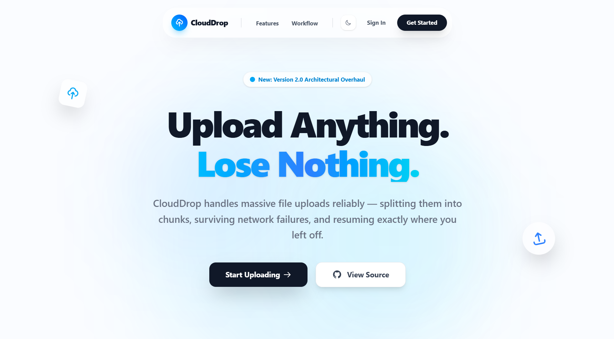
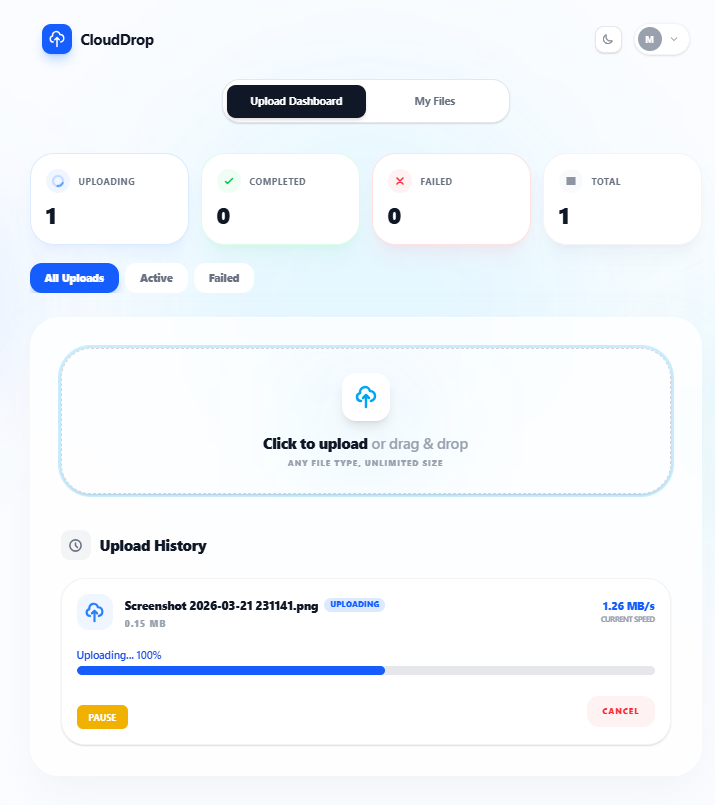
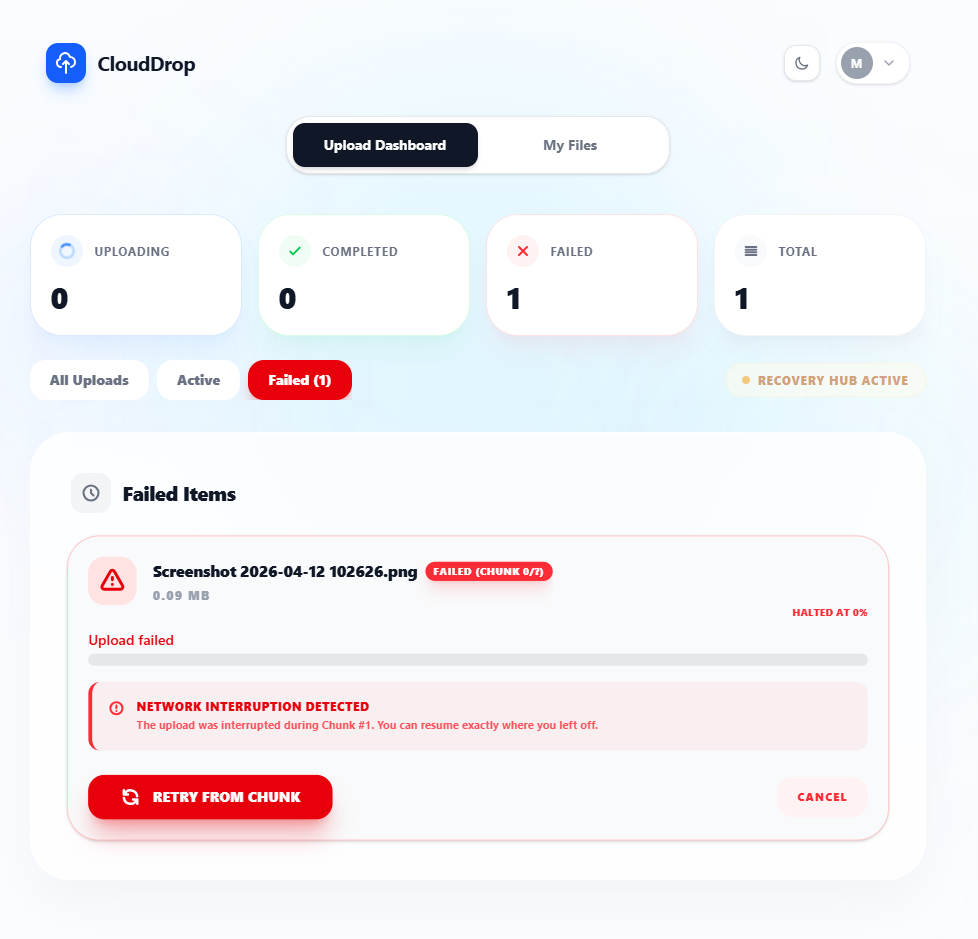
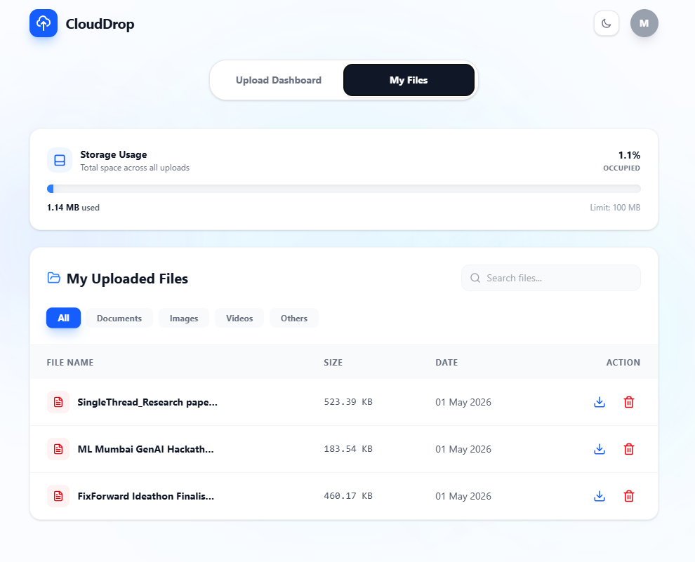
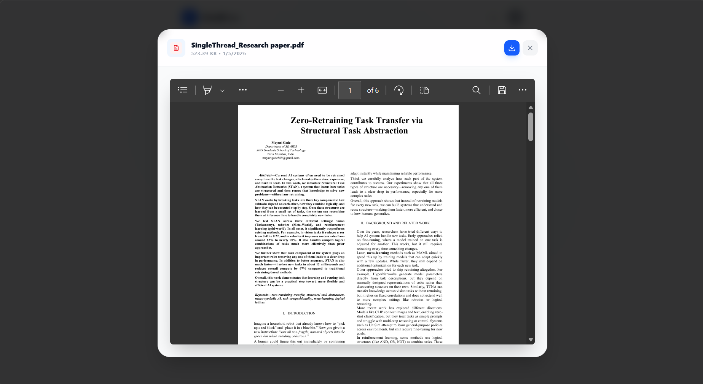

<div align="center">

# CloudDrop ☁️

### Production-Grade Chunked File Upload System

*A robust, full-stack file management application that handles massive file uploads reliably — splitting them into chunks, surviving network failures, and resuming exactly where you left off.*

[](https://react.dev)
[](https://nodejs.org)
[](https://mongodb.com)
[](https://typescriptlang.org)
[](./LICENSE)

[🚀 Getting Started](#getting-started) · [🏗️ Architecture](#architecture) · [✨ Features](#features) · [📸 Screenshots](#screenshots) · [🌐 Live Demo](#live-demo)

</div>

---

## 🧠 What is CloudDrop?

CloudDrop is a production-grade MERN stack application built to answer one question:

> **How do you upload a large file reliably over an unstable internet connection — without ever starting over?**

It solves this by breaking every file into small chunks (5MB each), uploading them sequentially, and tracking exactly which chunks the server has already received. If your connection drops at chunk 37 of 200 — CloudDrop resumes at chunk 37. Not chunk 1.

No timeouts. No full restarts. Just reliable file delivery — with a full user authentication system, file management dashboard, and real-time progress tracking built on top.

---

<a name="screenshots"></a>

## 📸 Screenshots

### 🌐 Landing Page
> *Clean, airy landing page with sky-blue gradients. Hero section with "Upload Anything. Lose Nothing." headline, feature highlights, workflow steps, and light/dark mode toggle in navbar.*



---

### 🚀 Upload Dashboard — Upload History
> *All Uploads tab showing upload history with drag-and-drop zone. Queue filter tabs — All Uploads, Active, Failed — let users quickly navigate between upload states.*



---

### 🔴 Failed Upload — Network Recovery
> *When a network interruption is detected mid-upload, CloudDrop identifies the exact failed chunk, halts at the precise percentage, and surfaces a "Retry From Chunk" button to resume without restarting the entire file. Recovery Hub monitors all uploads in the background.*



---

### 📁 My Files — File Management Dashboard
> *Complete file library with Storage Usage card, file type filter tabs (All / Documents / Images / Videos / Others), live search bar, sort controls, and per-file Download and Delete icon actions.*



---

### 👁️ File Preview — In-App Document Viewer
> *Clicking any file name opens a full in-app preview modal — no download required. PDF viewer with zoom, page navigation, and toolbar controls rendered directly inside CloudDrop. Header shows file name, size, date, and a direct Download button.*



---

<a name="features"></a>

## ✨ Features

| | Feature | Description |
|---|---|---|
| 🧩 | **Chunked Uploads** | Files split into 5MB segments — only failed chunks are retried, never the whole file |
| ⏸️ | **Pause & Resume** | Suspend any upload mid-transfer and resume later — even after a page refresh |
| 🔴 | **Network Recovery** | Detects interruptions, identifies exact failed chunk, resumes from that point |
| 🔁 | **Auto Retry** | Failed chunks are automatically retried without user intervention |
| 📋 | **Upload Queue Tabs** | Filter uploads by All, Active, or Failed — with meaningful empty states for each |
| ⚡ | **Active Monitor** | Live tracking of all currently running uploads in a dedicated view |
| ❌ | **Failed Items View** | Isolated view for failed uploads with Retry From Chunk option |
| 👁️ | **File Preview** | Click any file to preview PDFs, images, and videos directly in the browser |
| 🔍 | **Search & Filter** | Search files by name; filter by type — Documents, Images, Videos, Others |
| 🔃 | **Sort Files** | Sort your library by Date, Name, or Size in either direction |
| 💾 | **Storage Tracker** | Visual storage usage bar with percentage and 100MB limit indicator |
| 🗑️ | **Safe Delete** | Confirmation modal prevents accidental deletions |
| 🔐 | **JWT Auth** | Secure login and registration with token-based session management |
| 🛡️ | **Rate Limiting** | Auth and upload endpoints protected against brute-force attacks |
| 🌗 | **Light / Dark Mode** | Toggle between light and dark themes across landing page and dashboard |
| 🔔 | **Toast Notifications** | Non-blocking feedback for every user action |
| 👤 | **User Profile** | Account details, cloud usage stats, and password management |

---

<a name="architecture"></a>

## 🏗️ Architecture

### How a Chunked Upload Works

```
Your large file
      ↓
Split into chunks (5MB each) — client side
      ↓
POST /api/upload  →  chunk 1  ✅
POST /api/upload  →  chunk 2  ✅
POST /api/upload  →  chunk 3  ❌  network drops
      ↓
Network Interruption Detected
Resume — retries chunk 3 only
      ↓
All chunks received → fs merges → final file saved
      ↓
Metadata written to MongoDB  ✅
```

---

## 🛠️ Tech Stack

| Layer | Technology |
|---|---|
| **Frontend** | React 19, TypeScript, Vite, Tailwind CSS |
| **Backend** | Node.js, Express.js, TypeScript |
| **Database** | MongoDB Atlas, Mongoose |
| **Auth** | JSON Web Tokens (JWT), bcrypt |
| **File Handling** | Multer, Node.js `fs` module |
| **UI Libraries** | Lucide React, React Hot Toast |
| **Dev & Docs** | Vitest, Storybook, Chromatic |

---

## 📂 Directory Structure

```
file-uploader/
├── backend/
│   ├── src/
│   │   ├── middleware/        # JWT auth middleware
│   │   ├── models/            # User and File schemas
│   │   └── routes/            # Auth and upload routes
│   ├── temp/                  # Temporary chunk storage
│   └── uploads/               # Final merged files
│
├── frontend/
│   ├── src/
│   │   ├── components/        # UI components
│   │   ├── hooks/             # useFileUploader, useUploadQueue
│   │   └── services/          # API calls — auth, upload
│   └── index.html
│
└── README.md
```

---

<a name="getting-started"></a>

## 🚀 Getting Started

### Prerequisites

- Node.js `18+`
- MongoDB Atlas account

### Setup

```bash
# 1. Clone the repository
git clone https://github.com/your-username/file-uploader.git
cd file-uploader

# 2. Install dependencies
cd backend && npm install
cd ../frontend && npm install

# 3. Configure environment variables
cd backend && cp .env.example .env
```

Add your credentials to `backend/.env`:

```env
MONGO_URI=your_mongodb_atlas_connection_string
JWT_SECRET=your_jwt_secret_key
PORT=5000
```

```bash
# 4. Start backend
cd backend && npm run dev

# 5. Start frontend (new terminal)
cd frontend && npm run dev
```

Frontend → `http://localhost:5173`
Backend → `http://localhost:5000`

---

<a name="live-demo"></a>

## 🌐 Live Demo

> **Deployed Link:** https://clouddrop-frontend.onrender.com

---

## 📄 License

This project is licensed under the **MIT License** — see the [LICENSE](./LICENSE) file for details.

---

<div align="center">

*Built with React, Node.js, MongoDB, and a lot of chunked requests.*

**CloudDrop — Upload anything. Lose nothing.**

</div>
